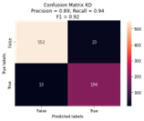

## Outline
1. [Summary](#summary)
2. [How to use](#how-to-use)
3. [Thesis results](#thesis-results)

### Summary
This repo is an outcome of my undergraduate thesis. The program uses the *segment and classify* method for automatic drum transcration. Which means there are two main steps here:
##### 1. Segmentation
The segmentation uses the implementation of [`onset_detect`](https://librosa.org/doc/main/generated/librosa.onset.onset_detect.html) function from Librosa. Audio is segmented based on the detected onsets for 0.15 seconds.

##### 2. Classification
The classification aims to learn spectrogram pattern of labels (snare drum, kick drum, hi-hat). Some models are experimented in the thesis: LSTM, Bi-LSTM, Conv-2D, Conv-1D, Conv2d-BiLSTM, but based on the multi-objective optimization in the thesis, this program uses the LSTM one.

Details on the results of thesis will be discussed in the later section.

### How To Use
1. Clone the repo to your workspace, you can use:
```
git clone https://github.com/coll-j/drum-transcription
```
2. Navigate to the cloned repo directory. Here you will find the main script named as `main.py` and a requirement file (`requirements.txt`). You can ignore other files.
```
cd drum-transcription
```
3. Install the required dependencies. I recommend to use a virtual environment
```
pip install -r requirements.txt
```
4. Once installed, you can run the program using this command:
```
uvicorn main:app --reload
```
5. If the application has started, you will see something like this:
```
INFO:     Will watch for changes in these directories: ['C:\\Users\\zk\\Documents\\TA\\repo']
INFO:     Uvicorn running on http://127.0.0.1:8000 (Press CTRL+C to quit)
INFO:     Started reloader process [4840] using WatchFiles
2022-07-29 21:38:10.131833: I tensorflow/core/platform/cpu_feature_guard.cc:151] This TensorFlow binary is optimized with oneAPI Deep Neural Network Library (oneDNN) to use the following CPU instructions in performance-critical operations:  AVX
To enable them in other operations, rebuild TensorFlow with the appropriate compiler flags.
INFO:     Started server process [13860]
INFO:     Waiting for application startup.
INFO:     Application startup complete.
```
6. Once started, you can access it from your browser at your local host. Typically at http://127.0.0.1:8000

### Thesis Results
Topics Discussed:
1. [Spectrogram](#spectrogram)
2. [Classification results](#classification-results)
3. [Future works](#future-works)

#### Spectrogram

<table>
    <thead>
        <tr>
            <th>Label</th>
            <th>MDB Drums</th>
            <th>IDMT-SMT Drums</th>
        </tr>
    </thead>
    <tbody>
        <tr>
            <th>KD</th>
            <th></th>
            <th></th>
        </tr>
        <tr>
            <th>SD</th>
            <th></th>
            <th></th>
        </tr>
        <tr>
            <th>HH</th>
            <th></th>
            <th></th>
        </tr>
    </tbody>
</table>


Above is the visualization of the median of the spectrograms. This was taken expecially from single label onsets. Hence, there are no overlapping labels in this visualization. Although IDMT-SMT Drums audio comes from different kinds of drums, we can see that there is a visible pattern in each label coming from both datasets here. You can find the code for visualization [here](https://colab.research.google.com/drive/1R3ZFVlcucahInK0dWMEvQ6JjB3be72p4). Bare in mind I haven't clean it up.

#### Classification results
<table>
    <thead>
        <tr>
            <th>Dataset</th>
            <th>Model</th>
            <th>Macro F1</th>
        </tr>
    </thead>
    <tbody>
        <tr>
            <td rowspan=5>MDB Drums</td>
            <td>LSTM</td>
            <td><b>0.7981</b></td>
        </tr>
        <tr>
            <td>BiLSTM</td>
            <td>0.7862</td>
        </tr>
        <tr>
            <td>Conv 1D</td>
            <td>0.7751</td>
        </tr>
        <tr>
	        <td>Conv 2D</td>
            <td>0.7684</td>
        </tr>
        <tr>
	        <td>Conv2D-BiLSTM</td>
            <td>0.7943</td>
        </tr>
     <tr>
            <td rowspan=5>IDMT-SMT Drums</td>
            <td>LSTM</td>
            <td>0.9075</td>
        </tr>
        <tr>
            <td>BiLSTM</td>
            <td>0.9079</td>
        </tr>
        <tr>
            <td>Conv 1D</td>
            <td>0.9078</td>
        </tr>
        <tr>
	        <td>Conv 2D</td>
            <td>0.9112</td>
        </tr>
        <tr>
	        <td>Conv2D-BiLSTM</td>
            <td><b>0.9209</b></td>
        </tr>
    </tbody>
</table>

Above is the evaluation result for the classification step on the testing data. The data are splitted with the proportion of 80%, 10%, 10% from all audio.  The testing data itself consists of 673 onsets on MDB Drums Dataset, and 626 onsets on IDMT-SMT Drums.

Here we can see a significant difference between both datasets. In my assumption, this happened because of the number of data. IDMT-SMT Drums  has more onsets and can learn more than using MDB Drums. Models in IDMT-SMT Drums tend to learn the HH label really well that yields a high number of True Positives as shown below. In which, it contributes to the Macro F1 score.
<table>
    <thead>
        <tr>
            <th>Dataset</th>
            <th>Label</th>
            <th>Confusion Matrix</th>
        </tr>
    </thead>
    <tbody>
        <tr>
            <td rowspan=3>MDB Drums</td>
            <td>KD</td>
            <td></td>
        </tr>
        <tr>
            <td>SD</td>
            <td></td>
        </tr>
        <tr>
            <td>HH</td>
            <td></td>
        </tr>
     <tr>
            <td rowspan=3>IDMT-SMT Drums</td>
            <td>KD</td>
            <td></td>
        </tr>
        <tr>
            <td>SD</td>
            <td></td>
        </tr>
        <tr>
            <td>HH</td>
            <td></td>
        </tr>
    </tbody>
</table>

The implementations can be found here:
* [Preprocessing](https://colab.research.google.com/drive/1vwCvE_G5rlnt3Yl4xBkmxxkUqYVGGOut)
* [MDB Drums](https://colab.research.google.com/drive/1KjHzvkrXlGPft1uLiHjZoAJHJ-NuwsNw)
* [IDMT-SMT Drums](https://colab.research.google.com/drive/1XnATMQFVHcWrJMv3A9HraUyzWLy5Xs67)

#### Future Works
I did gathered some idea in what to improve in the future
1. Imporve the onset detectin performance. I haven't mentioned it so far, but Librosa's onset detection yields a Macro F1 of 76.14% which is fairly low. Hence we can somehow tune it or try another method to get a better score.
2. As we know in the music theory, drum strikes tend to have a repetitive patterns, which also vary on the genres. If rely on the onset detection only, this pattern might not be captured. So I was thinking if we can somehow "fix" the drum pattern by looking at the overall generated notes, somekind of pattern matching.
3. This study was limited to three labels only, while in drums there are a lot of components that we can play such us tom-toms and cymbal family. Moreover, there are a variety of ways on to play them. Expanding to other parts of drums can be a really nice-to-have.
4. For user experience purpose, it will be nice to add a cursor when the song is played. This way, users can verify and follow the notation more easily.

### Notes
Please do correct me if I did or say anything wrong. I'm open to any idea or discussion. And if you want to cite my work, please do attach below. Thanks! :smiley:

```
Citation TBA
```